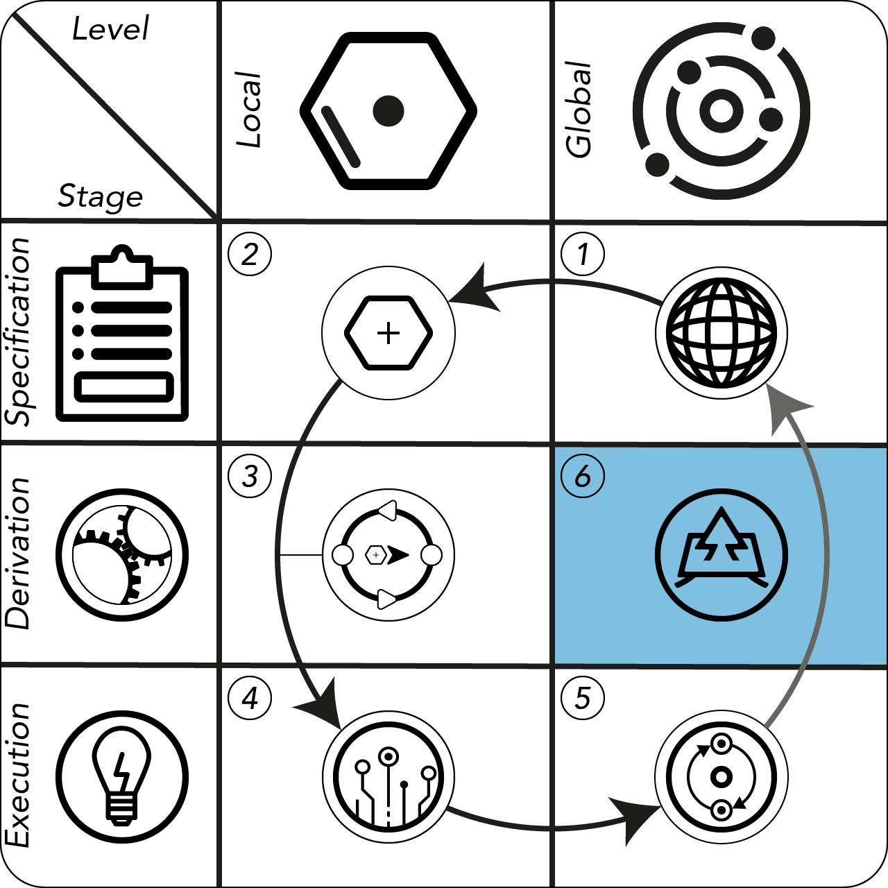
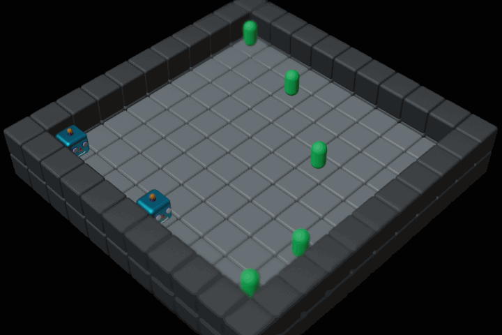
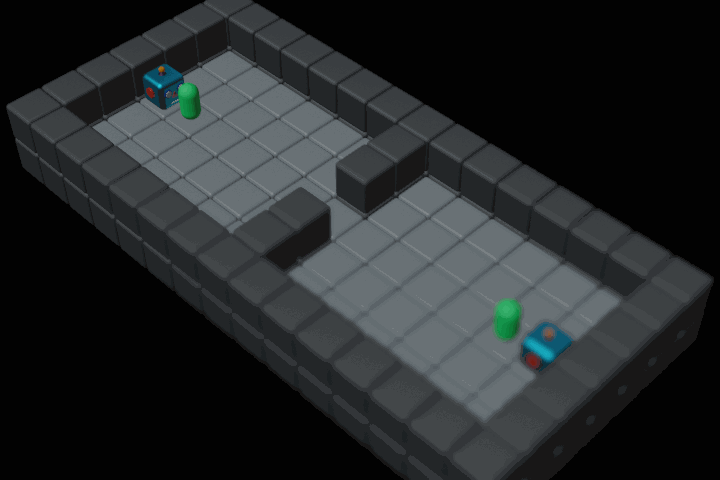
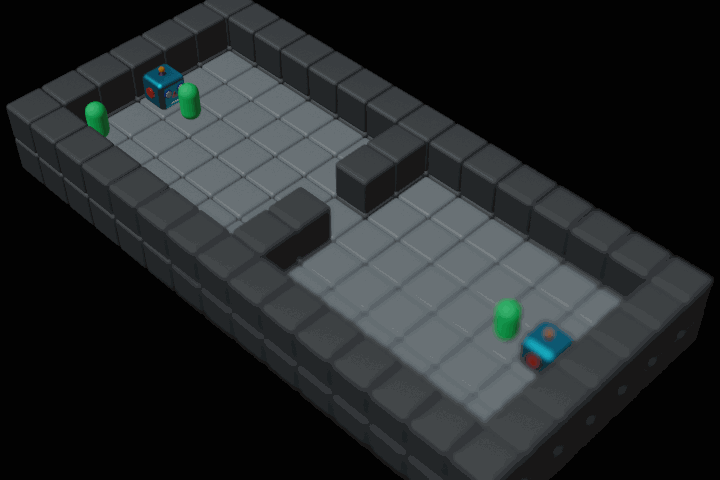

# Emergence in Multi-Agent Systems: A Safety Perspective

|[](https://arxiv.org/abs/2408.04514)| | |
|-|-|-|
|&emsp;&emsp;&emsp;&emsp;&emsp;&emsp;&emsp;&emsp;&emsp;&emsp;||&emsp;&emsp;&emsp;&emsp;&emsp;&emsp;&emsp;&emsp;&emsp;&emsp;|

## About

This is the code for the experiments of our paper. The experiments are build on top of the [EDYS environment](https://github.com/illiumst/marl-factory-grid), which we developed specifically for studying emergent behaviour in multi-agent systems. This environment is versatile and can be configured in various ways with different degrees of complexity.

## Setup

1. Set up a virtualenv with python 3.10 or higher. You can use pyvenv or conda for this.
2. Run ```pip install -r requirements.txt``` to get requirements.
3. In case there is no ```study_out/``` folder in the root directory, create one.

## Results

| | Emergent Behavior | Mitigated Emergence |
|-|-|-|
| `coin-quadrant`|  |  |
| `two-rooms` |  |  |

## Rerunning the Experiments

The respective experiments from our paper can be reenacted in [main.py](main.py). Just select the method representing the part of our experiments you want to rerun and execute it via the ```__main__``` function.

## Further Remarks

1. We use config files located in the [configs](marl_factory_grid/configs) and the  [multi_agent_configs](marl_factory_grid/algorithms/marl/multi_agent_configs),  [single_agent_configs](marl_factory_grid/algorithms/marl/single_agent_configs) folders to configure the environments and the RL algorithm for our experiments, respectively. You don't need to change anything to rerun the experiments, but we provided some additional comments in the configs for an overall better understanding of the functionalities.
2. The results of the experiment runs are stored in `study_out`.
3. We reuse the ```coin-quadrant``` implementation of the RL agent for the ```two_rooms``` environment. The coin assets are masked with flags in the visualization. This masking does not affect the RL agents in any way.
4. The code for the cost contortion for preventing the emergent behavior of the TSP agents can be found in [contortions.py](marl_factory_grid/algorithms/static/contortions.py).
5. The functionalities that drive the emergence prevention mechanisms for the RL agents is mainly located in the utility methods ```get_ordered_coin_piles (line 94)``` (for solving the emergence in the coin-quadrant environment) and ```distribute_indices (line 171)``` (mechanism for two_doors), that are part of [utils.py](marl_factory_grid/algorithms/marl/utils.py)
6. [agent_models](marl_factory_grid/algorithms/agent_models) contains the parameters of the trained models for the RL agents. You can repeat the training by executing the training procedures in  [main.py](main.py). Alternatively, you can use your own trained agents, which you have obtained by modifying the training configurations in [single_agent_configs](marl_factory_grid/algorithms/marl/single_agent_configs), for the evaluation experiments by inserting the names of the run folders, e.g. run9 and run 12, into the list in the methods ```coin_quadrant_multi_agent_rl_eval``` and ```two_rooms_multi_agent_rl_eval``` in [RL_runner.py](marl_factory_grid/algorithms/marl/RL_runner.py).

## Acknowledgments

This work was funded by the Bavarian Ministry for Economic Affairs, Regional Development and Energy as part of a project to support the thematic development of the Institute for Cognitive Systems.
